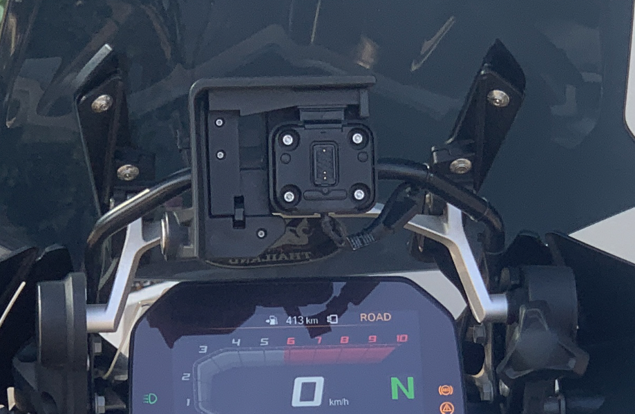
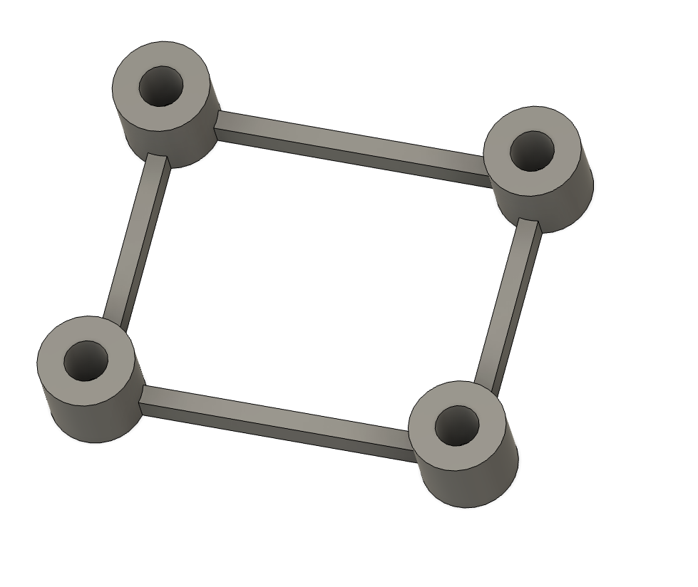
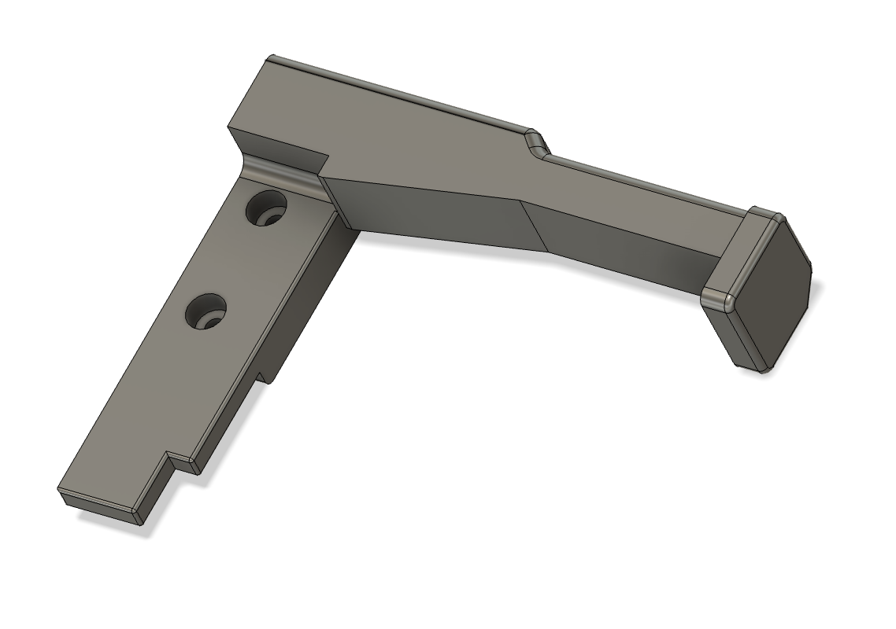
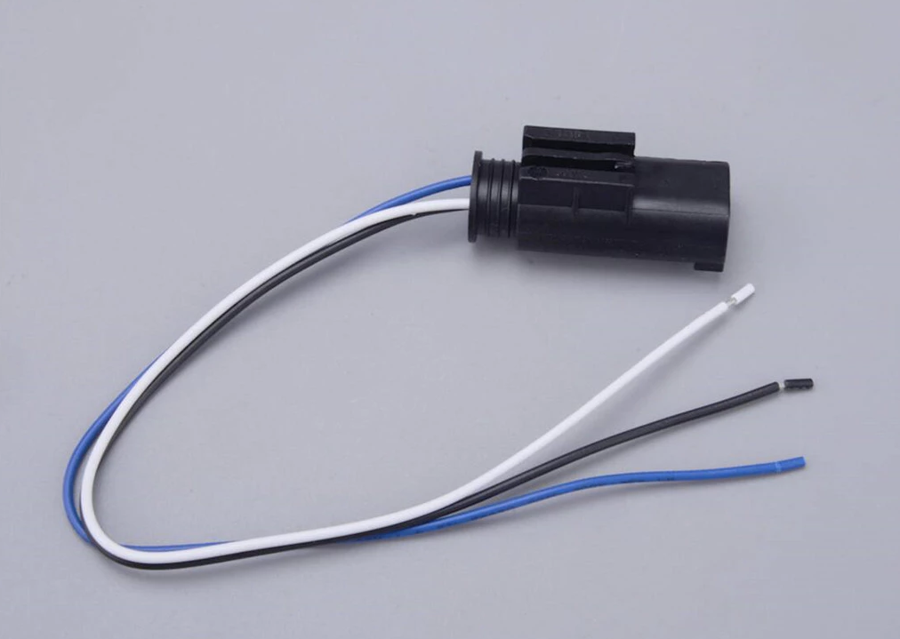

# Garmin-XT2-Mount-for-BMW
### 3D STL files and information about converting the BMW navigation cradle to accept a Garmin XT2 navigator.

This page documents how to adapt a BMW Navigator cradle to accept a Garmin XT2 (or XT).

Assuming that you already have the mounting base for the Garmin GPS, it just requires 2 3D printed parts and 4 pcs 4x40mm screws (the original screws are too short. And you should also get the suitable power plug so you don't need to cut into or modify original BMW cabling.

No modification of the original BMW cradle is necessary.

### Printing and material
I printed the parts in PLA-CF, but you can use ASA, ABS or other material as well.
Pure PLA is probably not a good idea as the parts are subjected to weather and sunlight.

 

## The end result

The Garmin adapter in the BMW cradle.

## The mount distance

This part "lifts up" the Garmin so it goes free of the edges of the BMW cradle. 
This is the **BMW GPS Cradle Distance for Garmin XT2.stl** file

## The mount lock

This parts allow you to lock the mount similar to the original BMW lock. 
This is the **BMW GPS Cradle Lock for Garmin XT2.stl** file

## The power plug

This connector plugs into the BMW wiring harness instead of the BMW nav cable.
You can connect this to the Garmin cable. 
**Please make sure you get the polarity right on the cable.**

The BMW "name" for this connector is 611656 8330 0413585

You can find it on several places on the net, Ebay, Lazada, Shopee, etc.

[Here's a link to the power plug on Shopee](
https://shopee.co.th/%E0%B9%83%E0%B8%AB%E0%B8%A1%E0%B9%88-Motorrad-GPS-%E0%B8%95%E0%B8%B1%E0%B8%A7%E0%B9%80%E0%B8%8A%E0%B8%B7%E0%B9%88%E0%B8%AD%E0%B8%A1%E0%B8%95%E0%B9%88%E0%B8%AD%E0%B8%8B%E0%B9%88%E0%B8%AD%E0%B8%A1-3-%E0%B9%80%E0%B8%AA%E0%B8%B2-611656-8330-0413585-%E0%B9%80%E0%B8%AB%E0%B8%A1%E0%B8%B2%E0%B8%B0%E0%B8%AA%E0%B9%8D%E0%B8%B2%E0%B8%AB%E0%B8%A3%E0%B8%B1%E0%B8%9A%E0%B8%A3%E0%B8%96%E0%B8%88%E0%B8%B1%E0%B8%81%E0%B8%A3%E0%B8%A2%E0%B8%B2%E0%B8%99%E0%B8%A2%E0%B8%99%E0%B8%95%E0%B9%8C-BMW-i.1338582490.52457946574?extraParams=%7B%22display_model_id%22%3A365705377297%2C%22model_selection_logic%22%3A3%7D&sp_atk=65a0571c-590d-464d-b508-a56eafa21347&xptdk=65a0571c-590d-464d-b508-a56eafa21347)

